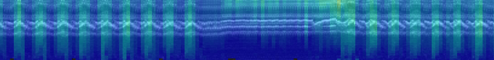

## Welcome !

At the crossroads of **muscle physiology**, **respiratory neurophysiology**, and **biomedical engineering**, the NEUromuscular RESpiratory Pathophysiology & Therapies research group  tackles critical challenges in respiratory health. We combine ultrafast ultrasound, molecular imaging, electrophysiology, and translational physiology to uncover how muscles, especially the diaphragm, operate, fail, and recover. Our aim is to convert these insights into quantitative biomarkers that bridge the gap between fundamental physiology and real-world clinical practice.

This work is driving the development of innovative diagnostic tools and interventions, including artificial neurostimulation and next-generation assisted ventilation.

The NEURES group is led by [Damien Bachasson](https://github.com/dambach) and belongs to the joint research unit [UMR-S 1158 – Experimental & Clinical Respiratory Neurophysiology](https://sante.sorbonne-universite.fr/structures-de-recherche/neurophysiologie-respiratoire-experimentale-et-clinique) based in Paris, France.

## Our vision
To measure, understand, and protect the muscles that drive every breath.

---

👀 [Contribution guide](GuideGitHub_NEURES.md)

<!--

**Here are some ideas to get you started:**

🙋‍♀️ A short introduction - what is your organization all about?
👀 Contribution guidelines - how do team members dive in?
👩‍💻 Useful resources - where do you keep your docs? Is there anything else the team should know?
🍪 Fun facts - what is your team's favorite snack?
🧙 Remember, you can do mighty things with the power of [Markdown](https://docs.github.com/github/writing-on-github/getting-started-with-writing-and-formatting-on-github/basic-writing-and-formatting-syntax)
-->
