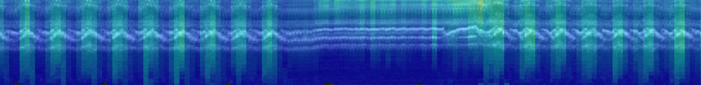

## NEURES group

At the crossroads of **muscle physiology**, **respiratory neurophysiology**, and **biomedical engineering**, the **NEU**romuscular **RES**piratory research group investigates how respiratory muscles, the diaphragm in particular, function, fail, and recover. Combining multimodal imaging (ultrafast ultrasound, shear wave elastography, molecular imaging), electrophysiology, and tissue-based analysis, we develop quantitative biomarkers that translate physiological insights into actionable metrics and bedside decisions. Our current work drives new diagnostic tools and therapeutic strategies, including muscle-informed assisted ventilation and neurostimulation.

The NEURES group is led by [Damien Bachasson](https://github.com/dambach) and belongs to the joint research unit [UMR-S 1158 – Experimental & Clinical Respiratory Neurophysiology](https://sante.sorbonne-universite.fr/structures-de-recherche/neurophysiologie-respiratoire-experimentale-et-clinique) based in Paris, France.

## Our vision
To measure, understand, and protect the muscles that drive every breath.

---

👀 [Contribution guide](GuideGitHub_NEURES.md)

<!--

**Here are some ideas to get you started:**

🙋‍♀️ A short introduction - what is your organization all about?
👀 Contribution guidelines - how do team members dive in?
👩‍💻 Useful resources - where do you keep your docs? Is there anything else the team should know?
🍪 Fun facts - what is your team's favorite snack?
🧙 Remember, you can do mighty things with the power of [Markdown](https://docs.github.com/github/writing-on-github/getting-started-with-writing-and-formatting-on-github/basic-writing-and-formatting-syntax)
-->
